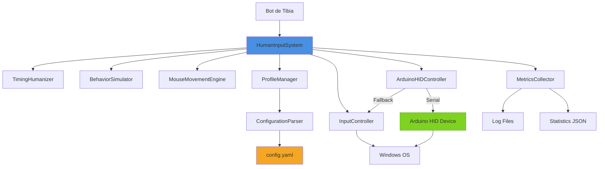
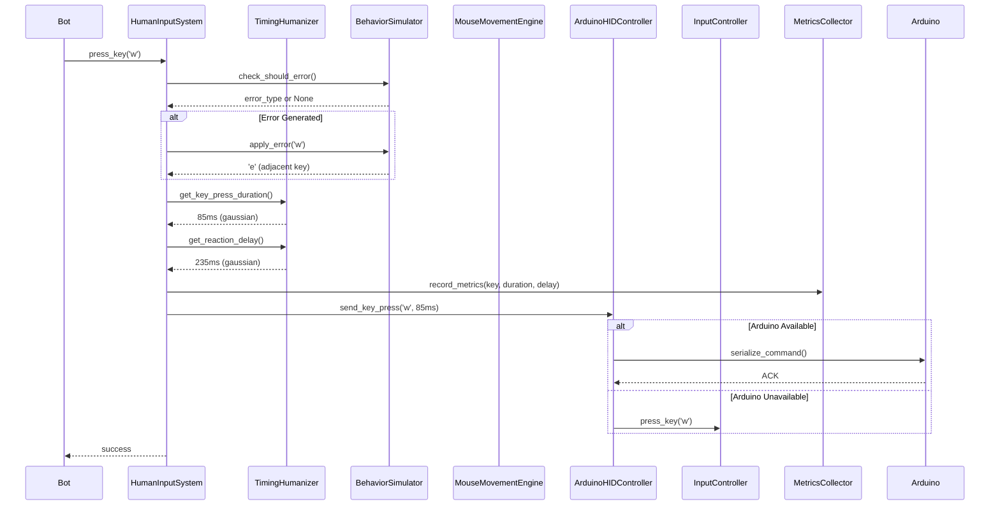
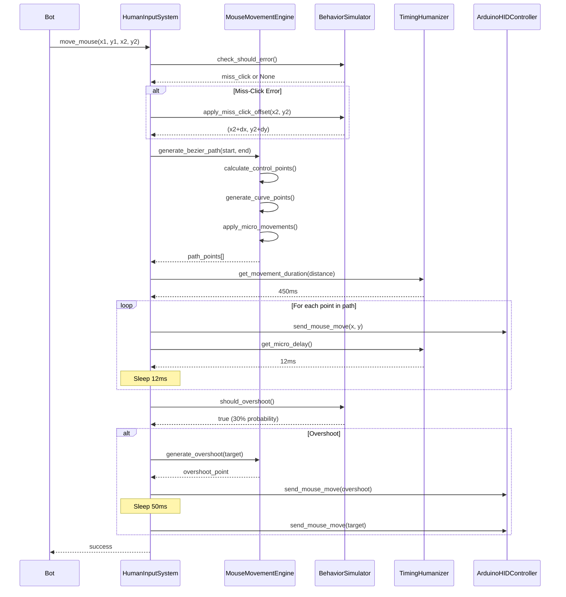

# Design Document: Sistema de Humanización de Inputs

## Overview

El Sistema de Humanización de Inputs es un middleware que se interpone entre el bot de Tibia y el InputController existente, aplicando múltiples capas de transformaciones para hacer que los inputs generados sean estadísticamente indistinguibles de los inputs de un jugador humano real.

El sistema opera en tres niveles:

1. **Nivel Temporal**: Introduce variabilidad en los tiempos de reacción, duraciones de teclas presionadas, y delays entre acciones usando distribuciones gaussianas.

2. **Nivel Comportamental**: Simula comportamientos humanos como fatiga progresiva, errores ocasionales, pausas AFK, y ajustes circadianos basados en la hora del día.

3. **Nivel Físico (Opcional)**: Envía inputs mediante un dispositivo Arduino HID para que sean indistinguibles de un teclado/mouse físico a nivel de sistema operativo.

El diseño prioriza modularidad, extensibilidad, y performance mínimo overhead (<5ms por input).


## Architecture

### Component Diagram



### Data Flow Diagram



### Mouse Movement Sequence



## Components and Interfaces

### HumanInputSystem (Orquestador Principal)

El componente central que coordina todos los demás componentes y expone la interfaz compatible con InputController.

**Responsabilidades:**
- Exponer interfaz compatible con InputController existente
- Coordinar la aplicación de humanización en múltiples capas
- Gestionar el ciclo de vida de componentes
- Manejar fallbacks cuando componentes opcionales fallan

**Interface:**

```python
class HumanInputSystem:
    def __init__(self, config_path: str, input_controller: InputController):
        """
        Inicializa el sistema de humanización.
        
        Args:
            config_path: Ruta al archivo de configuración YAML
            input_controller: Instancia del InputController existente
        """
        pass
    
    def press_key(self, key: str, hold_duration: Optional[float] = None) -> bool:
        """
        Presiona una tecla con humanización aplicada.
        
        Args:
            key: Código de la tecla a presionar
            hold_duration: Duración opcional (si None, se genera automáticamente)
        
        Returns:
            True si el input se ejecutó exitosamente
        """
        pass
    
    def release_key(self, key: str) -> bool:
        """Suelta una tecla."""
        pass
    
    def move_mouse(self, x: int, y: int, relative: bool = False) -> bool:
        """
        Mueve el mouse con trayectoria humanizada.
        
        Args:
            x, y: Coordenadas destino
            relative: Si True, movimiento relativo a posición actual
        
        Returns:
            True si el movimiento se ejecutó exitosamente
        """
        pass
    
    def click(self, button: str = 'left', x: Optional[int] = None, 
              y: Optional[int] = None) -> bool:
        """
        Realiza un click con humanización.
        
        Args:
            button: 'left', 'right', o 'middle'
            x, y: Coordenadas opcionales (si None, usa posición actual)
        
        Returns:
            True si el click se ejecutó exitosamente
        """
        pass
    
    def set_profile(self, profile_name: str) -> bool:
        """Cambia el perfil de comportamiento activo."""
        pass
    
    def reload_config(self) -> bool:
        """Recarga la configuración sin reiniciar el sistema."""
        pass
    
    def get_metrics(self) -> Dict[str, Any]:
        """Retorna métricas recolectadas."""
        pass
    
    def enable_humanization(self, enabled: bool) -> None:
        """Habilita/deshabilita humanización (para debugging)."""
        pass
```


### TimingHumanizer

Genera delays y duraciones con distribuciones gaussianas para simular variabilidad temporal humana.

**Responsabilidades:**
- Generar reaction times (150-350ms, media 220ms)
- Generar key press durations (50-120ms, media 80ms)
- Generar micro-pauses (10-50ms)
- Aplicar ajustes basados en nivel de fatiga

**Interface:**

```python
class TimingHumanizer:
    def __init__(self, config: TimingConfig):
        """
        Inicializa el humanizador de timing.
        
        Args:
            config: Configuración con medias y desviaciones estándar
        """
        pass
    
    def get_reaction_time(self, fatigue_level: float = 0.0) -> float:
        """
        Genera un reaction time con distribución gaussiana.
        
        Args:
            fatigue_level: Nivel de fatiga (0.0-1.0) que incrementa el tiempo
        
        Returns:
            Tiempo en milisegundos (150-350ms base)
        
        Algorithm:
            1. Generar valor base con distribución N(220, 40)
            2. Aplicar factor de fatiga: base * (1 + fatigue_level * 0.5)
            3. Clamp al rango [150, 350 + fatigue_level * 200]
        """
        pass
    
    def get_key_press_duration(self, fatigue_level: float = 0.0) -> float:
        """
        Genera duración de presión de tecla.
        
        Returns:
            Duración en milisegundos (50-120ms)
        
        Algorithm:
            1. Generar valor con distribución N(80, 15)
            2. Aplicar factor de fatiga: base * (1 + fatigue_level * 0.3)
            3. Clamp al rango [50, 120 + fatigue_level * 50]
        """
        pass
    
    def get_micro_pause(self) -> float:
        """
        Genera un micro-pause para movimientos de mouse.
        
        Returns:
            Delay en milisegundos (10-50ms)
        
        Algorithm:
            1. Generar valor con distribución N(25, 8)
            2. Clamp al rango [10, 50]
        """
        pass
    
    def get_movement_duration(self, distance: float, 
                             fatigue_level: float = 0.0) -> float:
        """
        Calcula duración de movimiento de mouse basado en distancia.
        
        Args:
            distance: Distancia en píxeles
            fatigue_level: Nivel de fatiga
        
        Returns:
            Duración en milisegundos
        
        Algorithm:
            1. Base time = 200 + (distance / 500) * 600  # Fitts's Law approximation
            2. Aplicar variabilidad gaussiana: N(base, base * 0.15)
            3. Aplicar factor de fatiga: time * (1 + fatigue_level * 0.4)
            4. Clamp al rango [200, 2000]
        """
        pass
    
    def add_jitter(self, base_delay: float) -> float:
        """
        Agrega jitter aleatorio a un delay.
        
        Args:
            base_delay: Delay base en milisegundos
        
        Returns:
            Delay con jitter aplicado
        
        Algorithm:
            1. Generar jitter con distribución N(0, base_delay * 0.05)
            2. Retornar max(base_delay + jitter, 1.0)
        """
        pass
```


### BehaviorSimulator

Simula comportamientos humanos como fatiga, errores, y pausas AFK.

**Responsabilidades:**
- Mantener y actualizar nivel de fatiga
- Generar errores humanos con probabilidades configurables
- Gestionar pausas AFK
- Aplicar ajustes circadianos

**Interface:**

```python
class BehaviorSimulator:
    def __init__(self, config: BehaviorConfig):
        """
        Inicializa el simulador de comportamiento.
        
        Args:
            config: Configuración de tasas de error, fatiga, etc.
        """
        pass
    
    def update_fatigue(self, elapsed_time: float) -> None:
        """
        Actualiza el nivel de fatiga basado en tiempo transcurrido.
        
        Args:
            elapsed_time: Tiempo en segundos desde última actualización
        
        Algorithm:
            1. Calcular incremento: elapsed_time * fatigue_rate_per_hour / 3600
            2. fatigue_level = min(fatigue_level + incremento, 1.0)
            3. Si fatigue_level > 0.7, considerar generar pausa AFK
        """
        pass
    
    def should_generate_error(self) -> Optional[str]:
        """
        Determina si se debe generar un error y de qué tipo.
        
        Returns:
            Tipo de error ('wrong_key', 'double_press', 'miss_click', 
            'hesitation') o None
        
        Algorithm:
            1. Calcular error_rate_adjusted = base_error_rate * (1 + fatigue_level)
            2. Generar random() < error_rate_adjusted
            3. Si True, seleccionar tipo de error según probabilidades configuradas
        """
        pass
    
    def apply_wrong_key_error(self, intended_key: str) -> str:
        """
        Genera un error de tecla adyacente.
        
        Args:
            intended_key: Tecla que se intentaba presionar
        
        Returns:
            Tecla adyacente en el teclado
        
        Algorithm:
            1. Buscar intended_key en keyboard_layout
            2. Obtener teclas adyacentes (arriba, abajo, izquierda, derecha)
            3. Seleccionar una aleatoriamente
        """
        pass
    
    def apply_double_press_error(self) -> float:
        """
        Genera delay para error de doble presión.
        
        Returns:
            Delay entre presiones en milisegundos (20-80ms)
        
        Algorithm:
            1. Generar valor con distribución uniforme U(20, 80)
        """
        pass
    
    def apply_miss_click_offset(self, x: int, y: int) -> Tuple[int, int]:
        """
        Aplica offset para error de miss-click.
        
        Args:
            x, y: Coordenadas objetivo
        
        Returns:
            Coordenadas con offset aplicado
        
        Algorithm:
            1. Generar distancia con distribución uniforme U(5, 25)
            2. Generar ángulo aleatorio [0, 2π)
            3. dx = distancia * cos(ángulo)
            4. dy = distancia * sin(ángulo)
            5. Retornar (x + dx, y + dy)
        """
        pass
    
    def apply_hesitation_delay(self) -> float:
        """
        Genera delay para hesitación.
        
        Returns:
            Delay en milisegundos (200-800ms)
        
        Algorithm:
            1. Generar valor con distribución N(500, 150)
            2. Clamp al rango [200, 800]
        """
        pass
    
    def should_trigger_afk_pause(self) -> bool:
        """
        Determina si se debe iniciar una pausa AFK.
        
        Returns:
            True si se debe iniciar pausa
        
        Algorithm:
            1. Calcular probabilidad base por hora desde config
            2. Ajustar por fatiga: prob * (1 + fatigue_level * 2)
            3. Verificar que no estemos en situación crítica
            4. Generar random() < probabilidad_ajustada
        """
        pass
    
    def generate_afk_duration(self) -> float:
        """
        Genera duración de pausa AFK.
        
        Returns:
            Duración en segundos (30-300)
        
        Algorithm:
            1. Generar valor con distribución log-normal
            2. μ = log(90), σ = 0.8
            3. Clamp al rango [30, 300]
        """
        pass
    
    def reset_fatigue_after_afk(self) -> None:
        """
        Resetea fatiga después de pausa AFK.
        
        Algorithm:
            1. Generar nuevo nivel con distribución uniforme U(0.2, 0.4)
            2. fatigue_level = nuevo_nivel
        """
        pass
    
    def get_fatigue_level(self) -> float:
        """Retorna el nivel actual de fatiga (0.0-1.0)."""
        pass
    
    def is_in_critical_situation(self) -> bool:
        """
        Verifica si estamos en situación crítica (no generar pausas AFK).
        
        Returns:
            True si en combate o HP bajo
        
        Note:
            Requiere integración con el estado del bot
        """
        pass
```


### MouseMovementEngine

Genera trayectorias naturales de mouse usando curvas de Bézier.

**Responsabilidades:**
- Generar curvas de Bézier cúbicas para movimientos
- Aplicar micro-movimientos y perturbaciones
- Simular overshooting ocasional
- Calcular velocidad variable (aceleración-desaceleración)

**Interface:**

```python
class MouseMovementEngine:
    def __init__(self, config: MouseConfig):
        """
        Inicializa el motor de movimiento de mouse.
        
        Args:
            config: Configuración de parámetros de movimiento
        """
        pass
    
    def generate_bezier_path(self, start: Tuple[int, int], 
                            end: Tuple[int, int],
                            num_points: int = 50) -> List[Tuple[int, int]]:
        """
        Genera trayectoria de Bézier cúbica entre dos puntos.
        
        Args:
            start: Coordenadas iniciales (x, y)
            end: Coordenadas finales (x, y)
            num_points: Número de puntos en la trayectoria
        
        Returns:
            Lista de coordenadas (x, y) formando la trayectoria
        
        Algorithm:
            1. Calcular distancia euclidiana entre start y end
            2. Generar puntos de control:
               - P0 = start
               - P3 = end
               - offset_ratio = random.uniform(0.1, 0.3)
               - P1 = interpolar entre P0 y P3 en t=0.33 + offset perpendicular
               - P2 = interpolar entre P0 y P3 en t=0.66 + offset perpendicular
            3. Para cada t en linspace(0, 1, num_points):
               - Calcular punto en curva de Bézier cúbica:
                 B(t) = (1-t)³P0 + 3(1-t)²tP1 + 3(1-t)t²P2 + t³P3
            4. Aplicar micro-movimientos a puntos intermedios
            5. Retornar lista de puntos
        """
        pass
    
    def apply_micro_movements(self, points: List[Tuple[int, int]]) -> List[Tuple[int, int]]:
        """
        Aplica perturbaciones pequeñas a la trayectoria.
        
        Args:
            points: Lista de puntos de la trayectoria
        
        Returns:
            Lista de puntos con micro-movimientos aplicados
        
        Algorithm:
            1. Para cada punto (excepto primero y último):
               - Generar offset_x con N(0, 1.5)
               - Generar offset_y con N(0, 1.5)
               - Clamp offsets a [-3, 3]
               - Aplicar offsets al punto
            2. Retornar puntos modificados
        """
        pass
    
    def calculate_velocity_profile(self, num_points: int) -> List[float]:
        """
        Calcula perfil de velocidad con aceleración-desaceleración.
        
        Args:
            num_points: Número de puntos en la trayectoria
        
        Returns:
            Lista de factores de velocidad (0.0-1.0) para cada punto
        
        Algorithm:
            1. Usar función sigmoide para aceleración suave:
               - Para t en [0, 0.3]: aceleración (sigmoide creciente)
               - Para t en [0.3, 0.7]: velocidad constante
               - Para t en [0.7, 1.0]: desaceleración (sigmoide decreciente)
            2. v(t) = 0.5 + 0.5 * tanh(4 * (t - 0.15)) para t < 0.3
            3. v(t) = 1.0 para 0.3 <= t <= 0.7
            4. v(t) = 0.5 + 0.5 * tanh(4 * (0.85 - t)) para t > 0.7
        """
        pass
    
    def should_overshoot(self) -> bool:
        """
        Determina si se debe simular overshooting.
        
        Returns:
            True con probabilidad 0.3
        """
        pass
    
    def generate_overshoot_point(self, target: Tuple[int, int], 
                                 approach_vector: Tuple[float, float]) -> Tuple[int, int]:
        """
        Genera punto de overshoot más allá del objetivo.
        
        Args:
            target: Coordenadas objetivo
            approach_vector: Vector de aproximación normalizado
        
        Returns:
            Coordenadas de overshoot
        
        Algorithm:
            1. Generar distancia de overshoot con U(5, 15) píxeles
            2. overshoot_x = target_x + approach_vector_x * distancia
            3. overshoot_y = target_y + approach_vector_y * distancia
            4. Retornar (overshoot_x, overshoot_y)
        """
        pass
    
    def calculate_approach_vector(self, path: List[Tuple[int, int]]) -> Tuple[float, float]:
        """
        Calcula vector de aproximación desde últimos puntos de la trayectoria.
        
        Args:
            path: Trayectoria completa
        
        Returns:
            Vector normalizado (vx, vy)
        
        Algorithm:
            1. Tomar últimos 5 puntos de la trayectoria
            2. Calcular vector promedio entre puntos consecutivos
            3. Normalizar vector resultante
        """
        pass
```


### ArduinoHIDController

Gestiona comunicación con dispositivo Arduino HID y fallback a InputController.

**Responsabilidades:**
- Establecer comunicación serial con Arduino
- Serializar comandos de input
- Manejar timeouts y errores
- Fallback automático a PostMessage

**Interface:**

```python
class ArduinoHIDController:
    def __init__(self, config: ArduinoConfig, fallback_controller: InputController):
        """
        Inicializa el controlador de Arduino HID.
        
        Args:
            config: Configuración de puerto serial y baudrate
            fallback_controller: InputController para fallback
        """
        pass
    
    def initialize(self) -> bool:
        """
        Detecta y establece conexión con Arduino.
        
        Returns:
            True si Arduino está disponible y conectado
        
        Algorithm:
            1. Escanear puertos COM disponibles
            2. Para cada puerto:
               - Intentar abrir conexión serial (baudrate 115200)
               - Enviar comando PING
               - Esperar respuesta PONG con timeout 500ms
               - Si responde correctamente, marcar como conectado
            3. Si no se encuentra Arduino, marcar como no disponible
        """
        pass
    
    def send_key_press(self, key: str, duration: float) -> bool:
        """
        Envía comando de presión de tecla al Arduino.
        
        Args:
            key: Código de tecla
            duration: Duración en milisegundos
        
        Returns:
            True si el comando se ejecutó exitosamente
        
        Algorithm:
            1. Serializar comando: "KEY_PRESS|{key}|{duration}\\n"
            2. Enviar por puerto serial
            3. Esperar ACK con timeout 100ms
            4. Si timeout o error, usar fallback
        """
        pass
    
    def send_mouse_move(self, x: int, y: int, relative: bool = False) -> bool:
        """
        Envía comando de movimiento de mouse al Arduino.
        
        Args:
            x, y: Coordenadas
            relative: Si True, movimiento relativo
        
        Returns:
            True si el comando se ejecutó exitosamente
        
        Algorithm:
            1. Serializar comando: "MOUSE_MOVE|{x}|{y}|{relative}\\n"
            2. Enviar por puerto serial
            3. Esperar ACK con timeout 100ms
            4. Si timeout o error, usar fallback
        """
        pass
    
    def send_mouse_click(self, button: str) -> bool:
        """
        Envía comando de click de mouse al Arduino.
        
        Args:
            button: 'left', 'right', o 'middle'
        
        Returns:
            True si el comando se ejecutó exitosamente
        """
        pass
    
    def is_available(self) -> bool:
        """Retorna True si Arduino está conectado y respondiendo."""
        pass
    
    def close(self) -> None:
        """Cierra la conexión serial."""
        pass
    
    def _use_fallback(self, command_type: str, *args, **kwargs) -> bool:
        """
        Ejecuta comando usando InputController de fallback.
        
        Args:
            command_type: Tipo de comando ('key_press', 'mouse_move', etc.)
            *args, **kwargs: Argumentos del comando
        
        Returns:
            Resultado de la ejecución del fallback
        """
        pass
```

**Protocolo Serial:**

```
Formato de comandos (Arduino <- PC):
- KEY_PRESS|{keycode}|{duration_ms}\n
- KEY_RELEASE|{keycode}\n
- MOUSE_MOVE|{x}|{y}|{relative}\n
- MOUSE_CLICK|{button}\n
- PING\n

Formato de respuestas (Arduino -> PC):
- ACK\n
- PONG\n
- ERROR|{message}\n
```


### ProfileManager

Gestiona perfiles de comportamiento y ajustes dinámicos.

**Responsabilidades:**
- Cargar y gestionar perfiles de comportamiento
- Aplicar transiciones suaves entre perfiles
- Ajustar parámetros según hora del día
- Soportar perfiles personalizados

**Interface:**

```python
class ProfileManager:
    def __init__(self, config_parser: ConfigurationParser):
        """
        Inicializa el gestor de perfiles.
        
        Args:
            config_parser: Parser de configuración
        """
        pass
    
    def load_profiles(self) -> None:
        """
        Carga perfiles predefinidos y personalizados desde configuración.
        
        Algorithm:
            1. Cargar perfiles predefinidos (novato, experto, cansado)
            2. Cargar perfiles personalizados desde config.yaml
            3. Validar que todos los perfiles tengan parámetros requeridos
        """
        pass
    
    def set_active_profile(self, profile_name: str, 
                          transition_duration: float = 10.0) -> bool:
        """
        Cambia el perfil activo con transición suave.
        
        Args:
            profile_name: Nombre del perfil a activar
            transition_duration: Duración de transición en segundos (5-15s)
        
        Returns:
            True si el perfil existe y se activó
        
        Algorithm:
            1. Verificar que profile_name existe
            2. Obtener parámetros actuales y parámetros objetivo
            3. Iniciar transición gradual:
               - Para cada parámetro numérico:
                 - Calcular delta = (objetivo - actual) / num_steps
                 - En cada step (cada 100ms):
                   - actual += delta
                   - Aplicar nuevo valor
            4. Marcar perfil como activo
        """
        pass
    
    def get_active_profile(self) -> BehaviorProfile:
        """Retorna el perfil actualmente activo."""
        pass
    
    def apply_circadian_adjustments(self) -> None:
        """
        Aplica ajustes basados en hora del día.
        
        Algorithm:
            1. Obtener hora actual del sistema
            2. Si hora entre 23:00 y 06:00 (noche):
               - Incrementar fatigue_level_base en 0.2
               - Incrementar reaction_time_multiplier en 0.15-0.25
            3. Si hora entre 06:00 y 10:00 (mañana temprano):
               - Incrementar fatigue_level_base en 0.1
               - Incrementar reaction_time_multiplier en 0.05-0.10
            4. Si hora entre 10:00 y 18:00 (día):
               - Usar parámetros normales del perfil
            5. Si hora entre 18:00 y 23:00 (tarde):
               - Incrementar fatigue_level_base en 0.05
            6. Aplicar transición suave de 10-20 minutos
        """
        pass
    
    def create_custom_profile(self, name: str, params: Dict[str, Any]) -> bool:
        """
        Crea un perfil personalizado.
        
        Args:
            name: Nombre del perfil
            params: Diccionario con parámetros del perfil
        
        Returns:
            True si el perfil se creó exitosamente
        """
        pass
    
    def get_profile_parameters(self, profile_name: str) -> Optional[Dict[str, Any]]:
        """Retorna parámetros de un perfil específico."""
        pass
```

**Perfiles Predefinidos:**

```python
PREDEFINED_PROFILES = {
    "novato": {
        "reaction_time_mean": 280,
        "reaction_time_std": 50,
        "key_press_duration_mean": 95,
        "key_press_duration_std": 20,
        "error_rate_base": 0.08,
        "fatigue_rate_per_hour": 0.12,
        "afk_pause_probability_per_hour": 0.4,
    },
    "experto": {
        "reaction_time_mean": 180,
        "reaction_time_std": 30,
        "key_press_duration_mean": 65,
        "key_press_duration_std": 12,
        "error_rate_base": 0.02,
        "fatigue_rate_per_hour": 0.06,
        "afk_pause_probability_per_hour": 0.2,
    },
    "cansado": {
        "reaction_time_mean": 320,
        "reaction_time_std": 60,
        "key_press_duration_mean": 105,
        "key_press_duration_std": 25,
        "error_rate_base": 0.12,
        "fatigue_rate_per_hour": 0.15,
        "fatigue_level_initial": 0.6,
        "afk_pause_probability_per_hour": 0.8,
    }
}
```


### ConfigurationParser

Parser y validador de archivos de configuración YAML.

**Responsabilidades:**
- Parsear archivos YAML
- Validar parámetros y rangos
- Proporcionar valores por defecto
- Soportar hot-reload

**Interface:**

```python
class ConfigurationParser:
    def __init__(self, config_path: str):
        """
        Inicializa el parser de configuración.
        
        Args:
            config_path: Ruta al archivo config.yaml
        """
        pass
    
    def parse(self) -> Configuration:
        """
        Parsea el archivo de configuración.
        
        Returns:
            Objeto Configuration con todos los parámetros
        
        Raises:
            ConfigurationError: Si el archivo es inválido
        
        Algorithm:
            1. Leer archivo YAML
            2. Validar estructura básica
            3. Para cada sección (timing, behavior, mouse, arduino, profiles):
               - Validar parámetros requeridos
               - Aplicar valores por defecto para opcionales
               - Validar rangos numéricos
            4. Construir objeto Configuration
        """
        pass
    
    def validate_ranges(self, config: Dict[str, Any]) -> List[str]:
        """
        Valida que parámetros numéricos estén en rangos válidos.
        
        Args:
            config: Diccionario de configuración
        
        Returns:
            Lista de errores de validación (vacía si todo OK)
        
        Validation Rules:
            - reaction_time_mean: [100, 500]
            - reaction_time_std: [10, 100]
            - key_press_duration_mean: [30, 200]
            - key_press_duration_std: [5, 50]
            - error_rate_base: [0.0, 0.5]
            - fatigue_rate_per_hour: [0.0, 0.3]
            - fatigue_level_initial: [0.0, 1.0]
            - afk_pause_probability_per_hour: [0.0, 2.0]
        """
        pass
    
    def apply_defaults(self, config: Dict[str, Any]) -> Dict[str, Any]:
        """
        Aplica valores por defecto para parámetros opcionales.
        
        Args:
            config: Configuración parcial
        
        Returns:
            Configuración completa con defaults aplicados
        """
        pass
    
    def reload(self) -> Configuration:
        """
        Recarga la configuración desde archivo.
        
        Returns:
            Nueva configuración
        """
        pass
    
    def to_yaml(self, config: Configuration) -> str:
        """
        Serializa configuración a formato YAML.
        
        Args:
            config: Objeto Configuration
        
        Returns:
            String YAML válido
        """
        pass
```


### MetricsCollector

Recolecta y analiza métricas del comportamiento generado.

**Responsabilidades:**
- Registrar todas las métricas de inputs
- Calcular estadísticas en tiempo real
- Generar reportes en JSON
- Logging con rotación diaria

**Interface:**

```python
class MetricsCollector:
    def __init__(self, log_directory: str):
        """
        Inicializa el recolector de métricas.
        
        Args:
            log_directory: Directorio para archivos de log
        """
        pass
    
    def record_key_press(self, key: str, duration: float, 
                        reaction_time: float, had_error: bool) -> None:
        """
        Registra una presión de tecla.
        
        Args:
            key: Tecla presionada
            duration: Duración en ms
            reaction_time: Tiempo de reacción en ms
            had_error: Si hubo error en este input
        """
        pass
    
    def record_mouse_movement(self, start: Tuple[int, int], 
                             end: Tuple[int, int],
                             duration: float, path_length: int) -> None:
        """
        Registra un movimiento de mouse.
        
        Args:
            start, end: Coordenadas inicio y fin
            duration: Duración del movimiento en ms
            path_length: Número de puntos en la trayectoria
        """
        pass
    
    def record_error(self, error_type: str) -> None:
        """Registra un error generado."""
        pass
    
    def record_afk_pause(self, duration: float) -> None:
        """Registra una pausa AFK."""
        pass
    
    def get_statistics(self) -> Dict[str, Any]:
        """
        Calcula estadísticas de todas las métricas recolectadas.
        
        Returns:
            Diccionario con estadísticas:
            {
                "reaction_times": {
                    "mean": float,
                    "median": float,
                    "std": float,
                    "min": float,
                    "max": float,
                    "percentiles": {"p25": float, "p50": float, "p75": float, "p95": float}
                },
                "key_press_durations": {...},
                "error_rates": {
                    "total": float,
                    "by_type": {"wrong_key": float, "double_press": float, ...}
                },
                "mouse_movements": {
                    "avg_duration": float,
                    "avg_path_length": float
                },
                "afk_pauses": {
                    "count": int,
                    "avg_duration": float
                },
                "total_inputs": int,
                "session_duration": float
            }
        """
        pass
    
    def generate_report(self, output_path: str) -> None:
        """
        Genera reporte estadístico en formato JSON.
        
        Args:
            output_path: Ruta del archivo de salida
        """
        pass
    
    def rotate_logs(self) -> None:
        """
        Rota archivos de log diariamente.
        
        Algorithm:
            1. Verificar fecha del archivo de log actual
            2. Si es diferente a fecha actual:
               - Cerrar archivo actual
               - Renombrar a log_YYYY-MM-DD.txt
               - Crear nuevo archivo de log
        """
        pass
    
    def log_with_timestamp(self, message: str, level: str = "INFO") -> None:
        """
        Escribe mensaje al log con timestamp de microsegundos.
        
        Args:
            message: Mensaje a loguear
            level: Nivel de log (INFO, WARNING, ERROR)
        
        Format:
            [YYYY-MM-DD HH:MM:SS.ffffff] [LEVEL] message
        """
        pass
```


## Data Models

### Configuration Classes

```python
@dataclass
class TimingConfig:
    """Configuración de timing y delays."""
    reaction_time_mean: float = 220.0  # ms
    reaction_time_std: float = 40.0    # ms
    key_press_duration_mean: float = 80.0  # ms
    key_press_duration_std: float = 15.0   # ms
    micro_pause_mean: float = 25.0     # ms
    micro_pause_std: float = 8.0       # ms
    
    def validate(self) -> bool:
        """Valida que los parámetros estén en rangos válidos."""
        return (100 <= self.reaction_time_mean <= 500 and
                10 <= self.reaction_time_std <= 100 and
                30 <= self.key_press_duration_mean <= 200 and
                5 <= self.key_press_duration_std <= 50)


@dataclass
class BehaviorConfig:
    """Configuración de comportamiento y errores."""
    error_rate_base: float = 0.05
    error_probabilities: Dict[str, float] = field(default_factory=lambda: {
        "wrong_key": 0.4,
        "double_press": 0.3,
        "miss_click": 0.2,
        "hesitation": 0.1
    })
    fatigue_rate_per_hour: float = 0.10
    fatigue_level_initial: float = 0.0
    afk_pause_probability_per_hour: float = 0.3
    afk_min_duration: float = 30.0   # seconds
    afk_max_duration: float = 300.0  # seconds
    enable_circadian_adjustment: bool = True
    
    def validate(self) -> bool:
        """Valida configuración."""
        return (0.0 <= self.error_rate_base <= 0.5 and
                0.0 <= self.fatigue_rate_per_hour <= 0.3 and
                0.0 <= self.fatigue_level_initial <= 1.0 and
                abs(sum(self.error_probabilities.values()) - 1.0) < 0.01)


@dataclass
class MouseConfig:
    """Configuración de movimiento de mouse."""
    bezier_control_offset_min: float = 0.1  # 10% de distancia
    bezier_control_offset_max: float = 0.3  # 30% de distancia
    micro_movement_std: float = 1.5  # píxeles
    overshoot_probability: float = 0.3
    overshoot_distance_min: float = 5.0  # píxeles
    overshoot_distance_max: float = 15.0  # píxeles
    min_movement_duration: float = 200.0  # ms
    max_movement_duration: float = 2000.0  # ms
    points_per_movement: int = 50
    
    def validate(self) -> bool:
        """Valida configuración."""
        return (0.0 <= self.overshoot_probability <= 1.0 and
                self.min_movement_duration < self.max_movement_duration)


@dataclass
class ArduinoConfig:
    """Configuración de Arduino HID."""
    enabled: bool = False
    port: Optional[str] = None  # None = auto-detect
    baudrate: int = 115200
    timeout: float = 0.1  # seconds
    retry_attempts: int = 3
    
    def validate(self) -> bool:
        """Valida configuración."""
        return self.baudrate > 0 and self.timeout > 0


@dataclass
class BehaviorProfile:
    """Perfil de comportamiento completo."""
    name: str
    timing: TimingConfig
    behavior: BehaviorConfig
    mouse: MouseConfig
    description: str = ""
    
    def to_dict(self) -> Dict[str, Any]:
        """Convierte perfil a diccionario."""
        return {
            "name": self.name,
            "description": self.description,
            "timing": asdict(self.timing),
            "behavior": asdict(self.behavior),
            "mouse": asdict(self.mouse)
        }
    
    @classmethod
    def from_dict(cls, data: Dict[str, Any]) -> 'BehaviorProfile':
        """Crea perfil desde diccionario."""
        return cls(
            name=data["name"],
            description=data.get("description", ""),
            timing=TimingConfig(**data["timing"]),
            behavior=BehaviorConfig(**data["behavior"]),
            mouse=MouseConfig(**data["mouse"])
        )


@dataclass
class Configuration:
    """Configuración completa del sistema."""
    timing: TimingConfig
    behavior: BehaviorConfig
    mouse: MouseConfig
    arduino: ArduinoConfig
    profiles: Dict[str, BehaviorProfile]
    active_profile: str = "default"
    log_directory: str = "./logs"
    enable_humanization: bool = True
    
    def validate(self) -> List[str]:
        """
        Valida toda la configuración.
        
        Returns:
            Lista de errores (vacía si todo OK)
        """
        errors = []
        if not self.timing.validate():
            errors.append("Invalid timing configuration")
        if not self.behavior.validate():
            errors.append("Invalid behavior configuration")
        if not self.mouse.validate():
            errors.append("Invalid mouse configuration")
        if not self.arduino.validate():
            errors.append("Invalid Arduino configuration")
        if self.active_profile not in self.profiles:
            errors.append(f"Active profile '{self.active_profile}' not found")
        return errors
```


### Input Event Models

```python
@dataclass
class InputEvent:
    """Evento de input base."""
    timestamp: float  # microseconds
    event_type: str   # 'key_press', 'key_release', 'mouse_move', 'mouse_click'
    
    def to_serial_command(self) -> str:
        """Convierte evento a comando serial para Arduino."""
        raise NotImplementedError


@dataclass
class KeyPressEvent(InputEvent):
    """Evento de presión de tecla."""
    key: str
    duration: float  # ms
    had_error: bool = False
    error_type: Optional[str] = None
    
    def __post_init__(self):
        self.event_type = 'key_press'
    
    def to_serial_command(self) -> str:
        """Serializa a comando Arduino."""
        return f"KEY_PRESS|{self.key}|{int(self.duration)}\n"


@dataclass
class MouseMoveEvent(InputEvent):
    """Evento de movimiento de mouse."""
    x: int
    y: int
    relative: bool = False
    path: Optional[List[Tuple[int, int]]] = None
    
    def __post_init__(self):
        self.event_type = 'mouse_move'
    
    def to_serial_command(self) -> str:
        """Serializa a comando Arduino."""
        rel = "1" if self.relative else "0"
        return f"MOUSE_MOVE|{self.x}|{self.y}|{rel}\n"


@dataclass
class MouseClickEvent(InputEvent):
    """Evento de click de mouse."""
    button: str  # 'left', 'right', 'middle'
    x: Optional[int] = None
    y: Optional[int] = None
    
    def __post_init__(self):
        self.event_type = 'mouse_click'
    
    def to_serial_command(self) -> str:
        """Serializa a comando Arduino."""
        return f"MOUSE_CLICK|{self.button}\n"


@dataclass
class AFKPauseEvent:
    """Evento de pausa AFK."""
    start_time: float
    duration: float  # seconds
    fatigue_before: float
    fatigue_after: float
```

### Keyboard Layout Model

```python
class KeyboardLayout:
    """
    Modelo del layout de teclado para generar errores de teclas adyacentes.
    """
    
    # Layout QWERTY estándar
    LAYOUT = {
        'q': ['w', 'a', '1', '2'],
        'w': ['q', 'e', 's', 'a', '2', '3'],
        'e': ['w', 'r', 'd', 's', '3', '4'],
        'r': ['e', 't', 'f', 'd', '4', '5'],
        't': ['r', 'y', 'g', 'f', '5', '6'],
        'y': ['t', 'u', 'h', 'g', '6', '7'],
        'u': ['y', 'i', 'j', 'h', '7', '8'],
        'i': ['u', 'o', 'k', 'j', '8', '9'],
        'o': ['i', 'p', 'l', 'k', '9', '0'],
        'p': ['o', 'l', '0', '-'],
        'a': ['q', 'w', 's', 'z'],
        's': ['a', 'w', 'e', 'd', 'x', 'z'],
        'd': ['s', 'e', 'r', 'f', 'c', 'x'],
        'f': ['d', 'r', 't', 'g', 'v', 'c'],
        'g': ['f', 't', 'y', 'h', 'b', 'v'],
        'h': ['g', 'y', 'u', 'j', 'n', 'b'],
        'j': ['h', 'u', 'i', 'k', 'm', 'n'],
        'k': ['j', 'i', 'o', 'l', 'm'],
        'l': ['k', 'o', 'p'],
        'z': ['a', 's', 'x'],
        'x': ['z', 's', 'd', 'c'],
        'c': ['x', 'd', 'f', 'v'],
        'v': ['c', 'f', 'g', 'b'],
        'b': ['v', 'g', 'h', 'n'],
        'n': ['b', 'h', 'j', 'm'],
        'm': ['n', 'j', 'k'],
    }
    
    @classmethod
    def get_adjacent_keys(cls, key: str) -> List[str]:
        """
        Retorna teclas adyacentes a la tecla dada.
        
        Args:
            key: Tecla de referencia
        
        Returns:
            Lista de teclas adyacentes
        """
        return cls.LAYOUT.get(key.lower(), [])
    
    @classmethod
    def get_random_adjacent(cls, key: str) -> str:
        """
        Retorna una tecla adyacente aleatoria.
        
        Args:
            key: Tecla de referencia
        
        Returns:
            Tecla adyacente aleatoria, o la misma tecla si no hay adyacentes
        """
        adjacent = cls.get_adjacent_keys(key)
        if not adjacent:
            return key
        return random.choice(adjacent)
```


## Integration with InputController

### Wrapper Pattern

El HumanInputSystem actúa como un wrapper transparente del InputController existente:

```python
class HumanInputSystem:
    """
    Wrapper que aplica humanización sobre InputController existente.
    """
    
    def __init__(self, config_path: str, input_controller: InputController):
        self._input_controller = input_controller
        self._config = ConfigurationParser(config_path).parse()
        
        # Inicializar componentes
        self._timing = TimingHumanizer(self._config.timing)
        self._behavior = BehaviorSimulator(self._config.behavior)
        self._mouse = MouseMovementEngine(self._config.mouse)
        self._arduino = ArduinoHIDController(self._config.arduino, input_controller)
        self._profile_manager = ProfileManager(ConfigurationParser(config_path))
        self._metrics = MetricsCollector(self._config.log_directory)
        
        # Estado
        self._humanization_enabled = self._config.enable_humanization
        self._session_start = time.time()
        self._last_input_time = 0.0
        
        # Inicializar Arduino si está habilitado
        if self._config.arduino.enabled:
            self._arduino.initialize()
    
    def press_key(self, key: str, hold_duration: Optional[float] = None) -> bool:
        """
        Presiona una tecla con humanización completa.
        
        Flujo:
        1. Verificar si humanización está habilitada
        2. Actualizar fatiga basado en tiempo transcurrido
        3. Verificar si se debe generar error
        4. Aplicar error si corresponde
        5. Generar reaction delay
        6. Generar key press duration
        7. Ejecutar input (Arduino o fallback)
        8. Registrar métricas
        """
        if not self._humanization_enabled:
            return self._input_controller.press_key(key)
        
        # Actualizar fatiga
        elapsed = time.time() - self._session_start
        self._behavior.update_fatigue(elapsed)
        
        # Verificar pausa AFK
        if self._behavior.should_trigger_afk_pause():
            self._handle_afk_pause()
        
        # Verificar error
        error_type = self._behavior.should_generate_error()
        actual_key = key
        had_error = False
        
        if error_type == 'wrong_key':
            actual_key = self._behavior.apply_wrong_key_error(key)
            had_error = True
        elif error_type == 'double_press':
            # Presionar dos veces
            delay = self._behavior.apply_double_press_error()
            self._execute_key_press(key, hold_duration)
            time.sleep(delay / 1000.0)
            had_error = True
        elif error_type == 'hesitation':
            hesitation_delay = self._behavior.apply_hesitation_delay()
            time.sleep(hesitation_delay / 1000.0)
            had_error = True
        
        # Generar timing
        reaction_delay = self._timing.get_reaction_time(
            self._behavior.get_fatigue_level()
        )
        if hold_duration is None:
            hold_duration = self._timing.get_key_press_duration(
                self._behavior.get_fatigue_level()
            )
        
        # Aplicar reaction delay
        time.sleep(reaction_delay / 1000.0)
        
        # Ejecutar input
        success = self._execute_key_press(actual_key, hold_duration)
        
        # Registrar métricas
        self._metrics.record_key_press(
            actual_key, hold_duration, reaction_delay, had_error
        )
        if had_error:
            self._metrics.record_error(error_type)
        
        self._last_input_time = time.time()
        return success
    
    def _execute_key_press(self, key: str, duration: float) -> bool:
        """Ejecuta presión de tecla usando Arduino o fallback."""
        if self._arduino.is_available():
            return self._arduino.send_key_press(key, duration)
        else:
            self._input_controller.press_key(key)
            time.sleep(duration / 1000.0)
            self._input_controller.release_key(key)
            return True
    
    def _handle_afk_pause(self) -> None:
        """Maneja una pausa AFK."""
        duration = self._behavior.generate_afk_duration()
        fatigue_before = self._behavior.get_fatigue_level()
        
        self._metrics.log_with_timestamp(
            f"Starting AFK pause for {duration:.1f} seconds", "INFO"
        )
        self._metrics.record_afk_pause(duration)
        
        time.sleep(duration)
        
        self._behavior.reset_fatigue_after_afk()
        fatigue_after = self._behavior.get_fatigue_level()
        
        self._metrics.log_with_timestamp(
            f"AFK pause ended. Fatigue: {fatigue_before:.2f} -> {fatigue_after:.2f}",
            "INFO"
        )
        
        # Warm-up period
        warmup = random.uniform(2.0, 5.0)
        time.sleep(warmup)
```


## Configuration File Format

### config.yaml Structure

```yaml
# Human Input System Configuration

# Timing Configuration
timing:
  reaction_time_mean: 220.0        # ms
  reaction_time_std: 40.0          # ms
  key_press_duration_mean: 80.0   # ms
  key_press_duration_std: 15.0    # ms
  micro_pause_mean: 25.0          # ms
  micro_pause_std: 8.0            # ms

# Behavior Configuration
behavior:
  error_rate_base: 0.05           # 5% error rate
  error_probabilities:
    wrong_key: 0.4                # 40% of errors are wrong keys
    double_press: 0.3             # 30% are double presses
    miss_click: 0.2               # 20% are miss-clicks
    hesitation: 0.1               # 10% are hesitations
  
  fatigue_rate_per_hour: 0.10     # Fatigue increases 0.10 per hour
  fatigue_level_initial: 0.0      # Start with no fatigue
  
  afk_pause_probability_per_hour: 0.3  # 30% chance per hour
  afk_min_duration: 30.0          # seconds
  afk_max_duration: 300.0         # seconds
  
  enable_circadian_adjustment: true

# Mouse Movement Configuration
mouse:
  bezier_control_offset_min: 0.1  # 10% of distance
  bezier_control_offset_max: 0.3  # 30% of distance
  micro_movement_std: 1.5         # pixels
  overshoot_probability: 0.3      # 30% chance
  overshoot_distance_min: 5.0     # pixels
  overshoot_distance_max: 15.0    # pixels
  min_movement_duration: 200.0    # ms
  max_movement_duration: 2000.0   # ms
  points_per_movement: 50

# Arduino HID Configuration
arduino:
  enabled: false                  # Set to true to use Arduino
  port: null                      # null = auto-detect, or "COM3", "/dev/ttyACM0"
  baudrate: 115200
  timeout: 0.1                    # seconds
  retry_attempts: 3

# Behavior Profiles
profiles:
  default:
    name: "default"
    description: "Balanced profile for normal gameplay"
    timing:
      reaction_time_mean: 220.0
      reaction_time_std: 40.0
      key_press_duration_mean: 80.0
      key_press_duration_std: 15.0
    behavior:
      error_rate_base: 0.05
      fatigue_rate_per_hour: 0.10
      afk_pause_probability_per_hour: 0.3
    mouse:
      overshoot_probability: 0.3
  
  novato:
    name: "novato"
    description: "Slower reactions, more errors (beginner player)"
    timing:
      reaction_time_mean: 280.0
      reaction_time_std: 50.0
      key_press_duration_mean: 95.0
      key_press_duration_std: 20.0
    behavior:
      error_rate_base: 0.08
      fatigue_rate_per_hour: 0.12
      afk_pause_probability_per_hour: 0.4
    mouse:
      overshoot_probability: 0.4
  
  experto:
    name: "experto"
    description: "Fast reactions, few errors (expert player)"
    timing:
      reaction_time_mean: 180.0
      reaction_time_std: 30.0
      key_press_duration_mean: 65.0
      key_press_duration_std: 12.0
    behavior:
      error_rate_base: 0.02
      fatigue_rate_per_hour: 0.06
      afk_pause_probability_per_hour: 0.2
    mouse:
      overshoot_probability: 0.2
  
  cansado:
    name: "cansado"
    description: "Tired player with high fatigue"
    timing:
      reaction_time_mean: 320.0
      reaction_time_std: 60.0
      key_press_duration_mean: 105.0
      key_press_duration_std: 25.0
    behavior:
      error_rate_base: 0.12
      fatigue_rate_per_hour: 0.15
      fatigue_level_initial: 0.6
      afk_pause_probability_per_hour: 0.8
    mouse:
      overshoot_probability: 0.5

# System Configuration
system:
  active_profile: "default"
  log_directory: "./logs"
  enable_humanization: true
  enable_metrics: true
  enable_statistical_validation: false  # For testing only
```


## Correctness Properties

*A property is a characteristic or behavior that should hold true across all valid executions of a system—essentially, a formal statement about what the system should do. Properties serve as the bridge between human-readable specifications and machine-verifiable correctness guarantees.*

Las siguientes propiedades de correctitud deben ser verificadas mediante property-based testing para asegurar que el sistema de humanización funciona correctamente en todos los casos.


### Property 1: Gaussian Distribution Correctness

*For any* configuration with specified mean and standard deviation, generating 1000+ delay samples and calculating their statistics SHALL produce a mean and standard deviation within 5% of the configured values.

**Validates: Requirements 1.1, 1.5**

### Property 2: Timing Ranges Compliance

*For any* timing configuration, all generated values SHALL fall within their specified ranges:
- Reaction times: [150ms, 350ms + fatigue_adjustment]
- Key press durations: [50ms, 120ms + fatigue_adjustment]
- Micro-pauses: [10ms, 50ms]

**Validates: Requirements 1.2, 1.3, 1.4**

### Property 3: Statistical Normality

*For any* sequence of 1000+ generated delays, the distribution SHALL pass the Kolmogorov-Smirnov test for normality with p-value > 0.05.

**Validates: Requirements 1.6**


### Property 4: Fatigue Monotonic Increase

*For any* session with positive elapsed time and no AFK pauses, the fatigue level SHALL increase monotonically and remain within bounds [0.0, 1.0].

**Validates: Requirements 2.1, 2.7**

### Property 5: Fatigue Effects on Performance

*For any* two fatigue levels f1 < f2, the reaction times and error rates at f2 SHALL be greater than or equal to those at f1.

**Validates: Requirements 2.2, 2.3**

### Property 6: AFK Pause Triggers at High Fatigue

*For any* fatigue level exceeding 0.7, the probability of triggering an AFK pause SHALL be greater than the base probability.

**Validates: Requirements 2.4**


### Property 7: AFK Pause Resets Fatigue

*For any* AFK pause event, the fatigue level after the pause SHALL be in the range [0.2, 0.4].

**Validates: Requirements 2.5**

### Property 8: Fatigue Rate Bounds

*For any* hour of session time, the fatigue level increment SHALL be between 0.05 and 0.15.

**Validates: Requirements 2.6**

### Property 9: Error Rate Matches Configuration

*For any* sequence of 1000+ actions with configured error rate E, the observed error rate SHALL be within 10% of E (i.e., between 0.9E and 1.1E).

**Validates: Requirements 3.1, 3.7**


### Property 10: Wrong Key Adjacency

*For any* wrong key error generated for an intended key K, the actual key pressed SHALL be adjacent to K in the keyboard layout.

**Validates: Requirements 3.2**

### Property 11: Double Press Timing

*For any* double press error, the delay between the two presses SHALL be in the range [20ms, 80ms].

**Validates: Requirements 3.3**

### Property 12: Miss-Click Offset Range

*For any* miss-click error with target coordinates (x, y), the actual coordinates SHALL be offset by a distance in the range [5, 25] pixels.

**Validates: Requirements 3.4**


### Property 13: Hesitation Delay Range

*For any* hesitation error, the additional delay inserted SHALL be in the range [200ms, 800ms].

**Validates: Requirements 3.5**

### Property 14: Independent Error Probabilities

*For any* configuration with independent error type probabilities, generating 1000+ errors SHALL produce a distribution of error types matching the configured probabilities within 15%.

**Validates: Requirements 3.6**

### Property 15: Bézier Path Curvature

*For any* mouse movement from point A to point B, all segments of the generated path SHALL have curvature > 0.01 (no perfectly straight lines).

**Validates: Requirements 4.1, 4.8**


### Property 16: Bézier Control Point Offset

*For any* Bézier curve generated for a movement, the control points SHALL be offset from the direct line by 10-30% of the total distance.

**Validates: Requirements 4.2**

### Property 17: Velocity Profile Shape

*For any* generated mouse movement, the velocity profile SHALL follow an acceleration-deceleration pattern with maximum velocity in the middle 40% of the movement.

**Validates: Requirements 4.3**

### Property 18: Micro-Movements Presence

*For any* mouse movement path with 50+ points, at least 30% of intermediate points SHALL have micro-movements of 1-3 pixels applied.

**Validates: Requirements 4.4**


### Property 19: Overshoot Probability

*For any* sequence of 100+ mouse movements, approximately 30% (±10%) SHALL exhibit overshooting behavior.

**Validates: Requirements 4.5**

### Property 20: Movement Duration Proportionality

*For any* two movements with distances d1 < d2, the duration t2 for d2 SHALL be greater than or equal to t1 for d1 (accounting for randomness within ±20%).

**Validates: Requirements 4.6**

### Property 21: Target Accuracy

*For any* mouse movement from point A to point B, the final cursor position SHALL be within 2 pixels of point B.

**Validates: Requirements 4.7**


### Property 22: Arduino Command Round-Trip

*For any* valid input command, serializing to Arduino protocol then deserializing SHALL produce an equivalent command.

**Validates: Requirements 5.8**

### Property 23: Arduino Timeout Handling

*For any* command sent to Arduino, if no response is received within 100ms, the system SHALL use the fallback controller.

**Validates: Requirements 5.5, 5.6**

### Property 24: Configuration Round-Trip

*For any* valid configuration object, parsing to YAML then parsing back SHALL produce an equivalent configuration.

**Validates: Requirements 6.6**


### Property 25: Configuration Validation Errors

*For any* configuration with parameters outside valid ranges, the parser SHALL return descriptive error messages including the parameter name and valid range.

**Validates: Requirements 6.2, 6.3**

### Property 26: Default Values Application

*For any* partial configuration missing optional parameters, the parser SHALL apply default values such that the resulting configuration is valid and complete.

**Validates: Requirements 6.4**

### Property 27: Profile Transition Smoothness

*For any* profile change, all parameter values SHALL transition gradually over 5-15 seconds with no abrupt jumps exceeding 10% of the total change.

**Validates: Requirements 7.3**


### Property 28: Circadian Adjustments Correctness

*For any* time of day, if circadian adjustment is enabled, the applied fatigue and reaction time multipliers SHALL match the configured adjustments for that time period within 5%.

**Validates: Requirements 8.2, 8.3, 8.4**

### Property 29: Circadian Check Frequency

*For any* 15-minute period with circadian adjustment enabled, the system SHALL check and apply time-based adjustments exactly once.

**Validates: Requirements 8.1**

### Property 30: Circadian Transition Smoothness

*For any* circadian adjustment change, parameters SHALL transition smoothly over 10-20 minutes with no abrupt changes.

**Validates: Requirements 8.5**


### Property 31: Metrics Accuracy

*For any* sequence of recorded inputs, the calculated statistics (mean, median, std, percentiles) SHALL match the actual distribution of values within 1% error.

**Validates: Requirements 9.2, 9.3, 9.4, 9.5**

### Property 32: Metrics Report Format

*For any* generated metrics report, the JSON output SHALL be valid and parseable, containing all required fields (reaction_times, key_press_durations, error_rates, mouse_movements, afk_pauses, total_inputs, session_duration).

**Validates: Requirements 9.6**

### Property 33: Timestamp Precision

*For any* logged event, the timestamp SHALL have microsecond precision (6 decimal places).

**Validates: Requirements 9.7**


### Property 34: Humanization Bypass Performance

*For any* input when humanization is disabled, the execution time SHALL not exceed the base InputController time by more than 1ms (minimal overhead).

**Validates: Requirements 10.5**

### Property 35: Humanization Application

*For any* input when humanization is enabled, the system SHALL apply at least one humanization layer (timing, behavior, or movement) before execution.

**Validates: Requirements 10.2**

### Property 36: AFK Pause Duration Range

*For any* generated AFK pause, the duration SHALL be in the range [30 seconds, 300 seconds].

**Validates: Requirements 11.2**


### Property 37: AFK Warm-Up Period

*For any* AFK pause that ends, the system SHALL apply a warm-up period of 2-5 seconds before resuming normal input execution.

**Validates: Requirements 11.3**

### Property 38: AFK Critical Situation Avoidance

*For any* critical situation (combat, low HP), the system SHALL NOT trigger AFK pauses.

**Validates: Requirements 11.4**

### Property 39: AFK Probability Increases with Fatigue

*For any* two fatigue levels f1 < f2, the probability of AFK pause at f2 SHALL be greater than or equal to the probability at f1.

**Validates: Requirements 11.5**


### Property 40: AFK Logging Completeness

*For any* AFK pause, the system SHALL log both the start and end events with the actual duration.

**Validates: Requirements 11.6**

### Property 41: Statistical Validation Accuracy

*For any* generated distribution of 10000+ samples, the calculated mean, median, standard deviation, and percentiles SHALL match the theoretical values within 3%.

**Validates: Requirements 12.3**

### Property 42: No Suspicious Naming

*For any* module, class, or function name in the system, it SHALL NOT contain suspicious terms (bot, cheat, hack, auto).

**Validates: Requirements 13.1**


### Property 43: Non-Deterministic Sequences

*For any* two sequences of 100+ inputs generated with the same configuration, the sequences SHALL be statistically different (no deterministic patterns).

**Validates: Requirements 13.2**

### Property 44: Initialization Order Randomization

*For any* two system initializations, the order of component initialization SHALL be different with probability > 0.5.

**Validates: Requirements 13.5**

### Property 45: Loop Jitter Presence

*For any* internal loop iteration, the timing SHALL include jitter of 1-5ms (no perfect timing).

**Validates: Requirements 13.6**


### Property 46: Error Logging Completeness

*For any* error that occurs in any component, the system SHALL log the error with a complete stack trace.

**Validates: Requirements 14.1**

### Property 47: Component Retry Logic

*For any* component that fails, the system SHALL attempt recovery up to 3 times before disabling the component.

**Validates: Requirements 14.4**

### Property 48: Graceful Degradation

*For any* optional component failure (Arduino, metrics), the system SHALL continue operating with reduced functionality rather than crashing.

**Validates: Requirements 14.5**


## Error Handling

### Error Categories

1. **Configuration Errors**
   - Invalid YAML syntax
   - Parameters out of range
   - Missing required fields
   - **Handling**: Log error, use default configuration, notify user

2. **Hardware Errors**
   - Arduino not detected
   - Serial communication timeout
   - Arduino disconnected during operation
   - **Handling**: Automatic fallback to PostMessage, log warning

3. **Runtime Errors**
   - Invalid input coordinates
   - Null reference exceptions
   - File I/O errors (logs, config)
   - **Handling**: Log with stack trace, attempt recovery, continue with degraded functionality

4. **Critical Errors**
   - InputController unavailable
   - Memory allocation failures
   - Unrecoverable system state
   - **Handling**: Log critical error, notify user, offer safe mode


### Recovery Strategies

```python
class ErrorRecovery:
    """Estrategias de recuperación de errores."""
    
    @staticmethod
    def handle_arduino_failure(controller: ArduinoHIDController) -> bool:
        """
        Maneja fallo de Arduino.
        
        Strategy:
        1. Log error con detalles
        2. Intentar reconectar (máximo 3 intentos)
        3. Si falla, marcar Arduino como no disponible
        4. Activar fallback a PostMessage
        5. Continuar operación normalmente
        """
        pass
    
    @staticmethod
    def handle_config_parse_error(error: Exception, 
                                  config_path: str) -> Configuration:
        """
        Maneja error de parseo de configuración.
        
        Strategy:
        1. Log error con línea y columna si disponible
        2. Intentar cargar configuración de backup
        3. Si falla, usar configuración por defecto
        4. Notificar usuario con warning
        5. Continuar con configuración cargada
        """
        pass
    
    @staticmethod
    def handle_component_failure(component_name: str, 
                                error: Exception,
                                retry_count: int) -> bool:
        """
        Maneja fallo de componente.
        
        Strategy:
        1. Log error con stack trace completo
        2. Si retry_count < 3:
           - Esperar 1 segundo
           - Intentar reinicializar componente
           - Incrementar retry_count
        3. Si retry_count >= 3:
           - Marcar componente como deshabilitado
           - Log warning sobre funcionalidad reducida
           - Continuar sin el componente
        """
        pass
```


## Testing Strategy

### Dual Testing Approach

El sistema requiere dos tipos complementarios de testing:

1. **Unit Tests**: Verifican ejemplos específicos, casos edge, y condiciones de error
2. **Property-Based Tests**: Verifican propiedades universales a través de muchos inputs generados

Ambos son necesarios para cobertura completa. Los unit tests capturan bugs concretos, mientras que los property tests verifican correctitud general.

### Property-Based Testing Configuration

**Framework**: Hypothesis (Python)

**Configuración mínima**:
- 100 iteraciones por test (debido a naturaleza aleatoria)
- Cada test debe referenciar su propiedad de diseño
- Tag format: `# Feature: human-input-system, Property {N}: {descripción}`

**Ejemplo de Property Test**:

```python
from hypothesis import given, strategies as st
import hypothesis.strategies as st
from scipy import stats

@given(st.integers(min_value=100, max_value=500),
       st.integers(min_value=10, max_value=100))
def test_gaussian_distribution_correctness(mean, std):
    """
    Feature: human-input-system, Property 1: Gaussian Distribution Correctness
    
    For any configuration with specified mean and standard deviation,
    generating 1000+ delay samples SHALL produce statistics within 5% of configured values.
    """
    config = TimingConfig(reaction_time_mean=mean, reaction_time_std=std)
    humanizer = TimingHumanizer(config)
    
    # Generate 1000 samples
    samples = [humanizer.get_reaction_time(fatigue_level=0.0) for _ in range(1000)]
    
    # Calculate statistics
    observed_mean = np.mean(samples)
    observed_std = np.std(samples)
    
    # Verify within 5% tolerance
    assert abs(observed_mean - mean) / mean < 0.05
    assert abs(observed_std - std) / std < 0.05
```


### Unit Testing Strategy

**Framework**: pytest

**Coverage objetivo**: Mínimo 85%

**Áreas de enfoque**:

1. **Ejemplos específicos**:
   - Perfil "novato" tiene error_rate > perfil "experto"
   - Arduino disponible → usa Arduino
   - Arduino no disponible → usa fallback
   - Configuración inválida → usa defaults

2. **Casos edge**:
   - Fatigue_level = 0.0 (sin fatiga)
   - Fatigue_level = 1.0 (fatiga máxima)
   - Movimiento de mouse distancia = 0
   - Configuración con todos los parámetros en límites

3. **Condiciones de error**:
   - Archivo YAML malformado
   - Arduino desconectado durante operación
   - Parámetros fuera de rango
   - Componente falla después de 3 reintentos

**Ejemplo de Unit Test**:

```python
def test_arduino_fallback_on_unavailable():
    """
    Verifica que el sistema usa fallback cuando Arduino no está disponible.
    """
    mock_input_controller = Mock(spec=InputController)
    arduino_config = ArduinoConfig(enabled=True, port="COM99")  # Puerto inexistente
    
    controller = ArduinoHIDController(arduino_config, mock_input_controller)
    controller.initialize()
    
    # Arduino no debería estar disponible
    assert not controller.is_available()
    
    # Enviar comando debería usar fallback
    controller.send_key_press('w', 80.0)
    
    # Verificar que se llamó al fallback
    mock_input_controller.press_key.assert_called_once_with('w')
```


### Integration Testing

**Objetivo**: Verificar que todos los componentes funcionan correctamente juntos.

**Escenarios de integración**:

1. **Flujo completo de input**:
   - Bot → HumanInputSystem → Timing → Behavior → Arduino/Fallback → OS
   - Verificar que se apliquen todas las capas de humanización
   - Verificar que las métricas se registren correctamente

2. **Cambio de perfil en runtime**:
   - Iniciar con perfil "default"
   - Cambiar a perfil "experto"
   - Verificar transición suave de parámetros
   - Verificar que los inputs reflejen el nuevo perfil

3. **Manejo de errores en cascada**:
   - Simular fallo de Arduino
   - Verificar fallback automático
   - Simular fallo de configuración
   - Verificar uso de defaults
   - Verificar que el sistema continúa operando

4. **Sesión larga con fatiga**:
   - Simular sesión de 2 horas
   - Verificar incremento gradual de fatiga
   - Verificar que se generen pausas AFK
   - Verificar reset de fatiga después de pausas

**Ejemplo de Integration Test**:

```python
def test_full_input_flow_with_humanization():
    """
    Verifica el flujo completo de un input con todas las capas de humanización.
    """
    # Setup
    config_path = "test_config.yaml"
    mock_input_controller = Mock(spec=InputController)
    
    system = HumanInputSystem(config_path, mock_input_controller)
    system.enable_humanization(True)
    
    # Ejecutar input
    start_time = time.time()
    system.press_key('w')
    end_time = time.time()
    
    # Verificar que se aplicó humanización (tomó más tiempo que input directo)
    elapsed_ms = (end_time - start_time) * 1000
    assert elapsed_ms > 150  # Al menos reaction time mínimo
    
    # Verificar que se registraron métricas
    metrics = system.get_metrics()
    assert metrics['total_inputs'] == 1
    assert 'reaction_times' in metrics
    assert len(metrics['reaction_times']['values']) == 1
```


### Statistical Validation Testing

**Objetivo**: Validar que las distribuciones generadas son estadísticamente similares a jugadores reales.

**Modo de testing especial**:
- Generar 10,000 samples de cada tipo de delay
- Ejecutar tests estadísticos (Kolmogorov-Smirnov, Chi-cuadrado)
- Comparar contra rangos esperados de jugadores humanos
- Generar gráficos de distribución para inspección visual

**Ejemplo de Validation Test**:

```python
def test_reaction_time_distribution_normality():
    """
    Verifica que la distribución de reaction times pasa test de normalidad.
    """
    config = TimingConfig(reaction_time_mean=220.0, reaction_time_std=40.0)
    humanizer = TimingHumanizer(config)
    
    # Generar 10,000 samples
    samples = [humanizer.get_reaction_time(0.0) for _ in range(10000)]
    
    # Kolmogorov-Smirnov test para normalidad
    statistic, p_value = stats.kstest(
        samples,
        lambda x: stats.norm.cdf(x, loc=220.0, scale=40.0)
    )
    
    # p-value > 0.05 indica que no podemos rechazar normalidad
    assert p_value > 0.05, f"Distribution failed normality test (p={p_value})"
    
    # Verificar que media y std están cerca de lo esperado
    assert abs(np.mean(samples) - 220.0) < 5.0
    assert abs(np.std(samples) - 40.0) < 3.0
```

### Performance Testing

**Objetivo**: Verificar que el overhead de humanización es mínimo.

**Métricas**:
- Overhead por input: < 5ms
- Throughput: > 100 inputs/segundo
- Uso de memoria: < 50MB

**Ejemplo de Performance Test**:

```python
def test_humanization_overhead():
    """
    Verifica que el overhead de humanización es menor a 5ms por input.
    """
    system = HumanInputSystem("config.yaml", Mock(spec=InputController))
    
    # Medir tiempo con humanización deshabilitada
    system.enable_humanization(False)
    start = time.perf_counter()
    for _ in range(100):
        system.press_key('w')
    baseline_time = time.perf_counter() - start
    
    # Medir tiempo con humanización habilitada (sin delays reales)
    system.enable_humanization(True)
    # Mock timing para eliminar delays reales
    system._timing.get_reaction_time = lambda f: 0.0
    system._timing.get_key_press_duration = lambda f: 0.0
    
    start = time.perf_counter()
    for _ in range(100):
        system.press_key('w')
    humanized_time = time.perf_counter() - start
    
    # Overhead por input
    overhead_per_input = (humanized_time - baseline_time) / 100 * 1000  # ms
    
    assert overhead_per_input < 5.0, f"Overhead too high: {overhead_per_input:.2f}ms"
```


## Arduino Firmware Design

### Hardware Requirements

- **Compatible boards**: Arduino Leonardo, Micro, Pro Micro (ATmega32U4)
- **Reason**: Estos boards tienen soporte nativo USB HID
- **Connections**: USB cable para comunicación serial y power

### Firmware Architecture

```cpp
// Arduino Firmware Pseudocode

#include <Keyboard.h>
#include <Mouse.h>

// Command buffer
char commandBuffer[128];
int bufferIndex = 0;

void setup() {
    Serial.begin(115200);
    Keyboard.begin();
    Mouse.begin();
}

void loop() {
    // Read commands from serial
    if (Serial.available() > 0) {
        char c = Serial.read();
        
        if (c == '\n') {
            // Process complete command
            processCommand(commandBuffer);
            bufferIndex = 0;
            memset(commandBuffer, 0, sizeof(commandBuffer));
        } else {
            commandBuffer[bufferIndex++] = c;
        }
    }
}

void processCommand(char* cmd) {
    // Parse command format: "COMMAND|arg1|arg2|...\n"
    char* token = strtok(cmd, "|");
    
    if (strcmp(token, "KEY_PRESS") == 0) {
        char* key = strtok(NULL, "|");
        char* duration = strtok(NULL, "|");
        
        Keyboard.press(key[0]);
        delay(atoi(duration));
        Keyboard.release(key[0]);
        
        Serial.println("ACK");
    }
    else if (strcmp(token, "MOUSE_MOVE") == 0) {
        char* x = strtok(NULL, "|");
        char* y = strtok(NULL, "|");
        char* relative = strtok(NULL, "|");
        
        if (atoi(relative) == 1) {
            Mouse.move(atoi(x), atoi(y), 0);
        } else {
            // Absolute positioning requires calculation
            // (not directly supported, would need screen resolution)
        }
        
        Serial.println("ACK");
    }
    else if (strcmp(token, "MOUSE_CLICK") == 0) {
        char* button = strtok(NULL, "|");
        
        if (strcmp(button, "left") == 0) {
            Mouse.click(MOUSE_LEFT);
        } else if (strcmp(button, "right") == 0) {
            Mouse.click(MOUSE_RIGHT);
        } else if (strcmp(button, "middle") == 0) {
            Mouse.click(MOUSE_MIDDLE);
        }
        
        Serial.println("ACK");
    }
    else if (strcmp(token, "PING") == 0) {
        Serial.println("PONG");
    }
    else {
        Serial.println("ERROR|Unknown command");
    }
}
```

### Firmware Upload Instructions

1. Instalar Arduino IDE
2. Seleccionar board correcto (Tools → Board → Arduino Leonardo/Micro)
3. Seleccionar puerto COM correcto (Tools → Port)
4. Cargar sketch
5. Verificar que el dispositivo aparece como HID en Device Manager


## Implementation Considerations

### Performance Optimization

1. **Lazy Initialization**:
   - Componentes opcionales (Arduino, MetricsCollector) se inicializan solo si están habilitados
   - Reduce tiempo de startup y uso de memoria

2. **Caching**:
   - Keyboard layout se carga una vez al inicio
   - Perfiles se cachean después de parsear
   - Reduce overhead de I/O

3. **Efficient Random Generation**:
   - Usar numpy para generación de números aleatorios (más rápido que random)
   - Pre-generar batches de números aleatorios para reducir overhead

4. **Minimal Locking**:
   - Usar locks solo donde sea absolutamente necesario
   - Preferir estructuras de datos thread-safe cuando sea posible

### Thread Safety

El sistema puede ser llamado desde múltiples threads (bot principal, UI thread, etc.):

1. **Shared State Protection**:
   - `fatigue_level`: Proteger con lock
   - `metrics`: Usar queue thread-safe para registros
   - `configuration`: Inmutable después de cargar (reload crea nueva instancia)

2. **Lock-Free Operations**:
   - Generación de números aleatorios (cada thread tiene su propio RNG)
   - Lectura de configuración (inmutable)
   - Cálculos matemáticos (sin estado compartido)

### Memory Management

1. **Bounded Collections**:
   - Métricas: Mantener solo últimas 10,000 entradas
   - Logs: Rotación diaria automática
   - Path points: Reusar buffers cuando sea posible

2. **Resource Cleanup**:
   - Cerrar puerto serial en destructor
   - Flush logs antes de cerrar
   - Liberar recursos de Arduino

### Security Considerations

1. **Anti-Detection**:
   - Nombres de módulos genéricos (no contener "bot", "cheat", etc.)
   - Randomizar orden de inicialización
   - No dejar firmas en memoria del proceso del juego
   - Usar Arduino HID para aparecer como dispositivo legítimo

2. **Configuration Security**:
   - No almacenar información sensible en config.yaml
   - Validar todos los inputs de configuración
   - Sanitizar paths de archivos

3. **Logging Security**:
   - No loguear información sensible (passwords, tokens)
   - Logs solo en directorio local (no enviar a red)
   - Rotación automática para evitar archivos enormes


### Extensibility

El diseño permite extensiones futuras:

1. **Nuevos Tipos de Errores**:
   - Agregar nuevo tipo en `BehaviorConfig.error_probabilities`
   - Implementar método `apply_<error_type>_error()` en `BehaviorSimulator`
   - No requiere cambios en otros componentes

2. **Nuevos Perfiles**:
   - Agregar perfil en config.yaml
   - Sistema lo carga automáticamente
   - Puede ser activado en runtime

3. **Nuevas Métricas**:
   - Agregar método `record_<metric>()` en `MetricsCollector`
   - Agregar campo en `get_statistics()`
   - No afecta componentes existentes

4. **Algoritmos Alternativos**:
   - Interfaces permiten swap de implementaciones
   - Ejemplo: Cambiar curvas de Bézier por splines
   - Solo requiere implementar misma interfaz

### Debugging Support

1. **Modo Debug**:
   - Deshabilitar humanización completamente
   - Logging verbose de todas las decisiones
   - Visualización de trayectorias de mouse

2. **Metrics Dashboard**:
   - Generar reportes HTML con gráficos
   - Mostrar distribuciones en tiempo real
   - Comparar contra rangos esperados

3. **Replay Capability**:
   - Grabar secuencia de inputs con timestamps
   - Reproducir secuencia para debugging
   - Verificar consistencia

### Deployment

1. **Packaging**:
   - Distribuir como módulo Python instalable
   - Incluir config.yaml de ejemplo
   - Incluir firmware de Arduino pre-compilado

2. **Dependencies**:
   - Python 3.11+
   - numpy, scipy (para estadísticas)
   - PyYAML (para configuración)
   - pyserial (para Arduino)
   - hypothesis (para testing)
   - pytest (para testing)

3. **Installation**:
   ```bash
   pip install human-input-system
   ```

4. **Configuration**:
   - Copiar config.yaml de ejemplo
   - Ajustar parámetros según necesidad
   - Opcional: Cargar firmware en Arduino

5. **Integration**:
   ```python
   from human_input_system import HumanInputSystem
   from bot.input_controller import InputController
   
   # Crear InputController existente
   input_controller = InputController()
   
   # Wrap con humanización
   humanized_input = HumanInputSystem(
       config_path="config.yaml",
       input_controller=input_controller
   )
   
   # Usar como InputController normal
   humanized_input.press_key('w')
   humanized_input.move_mouse(100, 200)
   ```


## Appendix: Mathematical Formulas

### Gaussian Distribution

Para generar valores con distribución normal:

```
X ~ N(μ, σ²)
X = μ + σ * Z

donde Z ~ N(0, 1) (distribución normal estándar)
```

Implementación en Python:
```python
import numpy as np

def gaussian(mean, std):
    return np.random.normal(mean, std)
```

### Bézier Cubic Curve

Curva de Bézier cúbica con 4 puntos de control (P0, P1, P2, P3):

```
B(t) = (1-t)³P₀ + 3(1-t)²tP₁ + 3(1-t)t²P₂ + t³P₃

donde t ∈ [0, 1]
```

Implementación:
```python
def bezier_cubic(t, P0, P1, P2, P3):
    return (
        (1-t)**3 * P0 +
        3 * (1-t)**2 * t * P1 +
        3 * (1-t) * t**2 * P2 +
        t**3 * P3
    )
```

### Fitts's Law (Movement Time)

Tiempo de movimiento basado en distancia y tamaño del objetivo:

```
MT = a + b * log₂(D/W + 1)

donde:
- MT = Movement Time
- D = Distance to target
- W = Width of target
- a, b = constantes empíricas
```

Simplificación para nuestro caso (W constante):
```
MT = 200 + (D / 500) * 600  # ms
```

### Sigmoid Function (Velocity Profile)

Para aceleración/desaceleración suave:

```
v(t) = 1 / (1 + e^(-k(t - t₀)))

donde:
- k = steepness (4 para transición suave)
- t₀ = inflection point (0.15 para aceleración, 0.85 para desaceleración)
```

Implementación:
```python
import numpy as np

def sigmoid(t, k=4, t0=0.5):
    return 1.0 / (1.0 + np.exp(-k * (t - t0)))
```

### Log-Normal Distribution (AFK Duration)

Para generar duraciones de pausas AFK con sesgo hacia valores más cortos:

```
X ~ LogNormal(μ, σ)
X = e^(μ + σZ)

donde Z ~ N(0, 1)
```

Para AFK pauses:
```python
import numpy as np

def afk_duration():
    mu = np.log(90)  # median = 90 seconds
    sigma = 0.8
    duration = np.random.lognormal(mu, sigma)
    return np.clip(duration, 30, 300)
```


## Appendix: Example Usage Scenarios

### Scenario 1: Basic Integration

```python
from human_input_system import HumanInputSystem
from bot.input_controller import InputController

# Initialize
input_controller = InputController()
his = HumanInputSystem("config.yaml", input_controller)

# Use normally
his.press_key('w')  # Move forward with humanization
his.press_key('space')  # Jump with humanization
his.move_mouse(500, 300)  # Move mouse with Bézier curve
his.click('left')  # Click with humanization
```

### Scenario 2: Profile Switching

```python
# Start with default profile
his = HumanInputSystem("config.yaml", input_controller)

# Play for a while...
time.sleep(3600)  # 1 hour

# Switch to "cansado" profile to simulate fatigue
his.set_profile("cansado")

# Inputs now reflect tired player behavior
his.press_key('w')  # Slower reaction, more errors
```

### Scenario 3: Metrics Analysis

```python
# Run bot for a session
his = HumanInputSystem("config.yaml", input_controller)

# ... bot plays for 2 hours ...

# Get metrics
metrics = his.get_metrics()

print(f"Total inputs: {metrics['total_inputs']}")
print(f"Average reaction time: {metrics['reaction_times']['mean']:.2f}ms")
print(f"Error rate: {metrics['error_rates']['total']:.2%}")
print(f"AFK pauses: {metrics['afk_pauses']['count']}")

# Generate detailed report
his._metrics.generate_report("session_report.json")
```

### Scenario 4: Arduino HID Setup

```python
# Enable Arduino in config.yaml:
# arduino:
#   enabled: true
#   port: "COM3"  # or null for auto-detect

his = HumanInputSystem("config.yaml", input_controller)

# System automatically detects and uses Arduino
# If Arduino fails, automatically falls back to PostMessage
his.press_key('w')  # Sent via Arduino HID if available
```

### Scenario 5: Debugging Mode

```python
# Disable humanization for debugging
his = HumanInputSystem("config.yaml", input_controller)
his.enable_humanization(False)

# Inputs execute immediately without delays
his.press_key('w')  # No humanization, instant execution

# Re-enable for normal operation
his.enable_humanization(True)
```

### Scenario 6: Custom Profile

```yaml
# In config.yaml, add custom profile:
profiles:
  my_custom_profile:
    name: "my_custom_profile"
    description: "My personalized behavior"
    timing:
      reaction_time_mean: 250.0
      reaction_time_std: 45.0
      key_press_duration_mean: 85.0
      key_press_duration_std: 18.0
    behavior:
      error_rate_base: 0.06
      fatigue_rate_per_hour: 0.08
      afk_pause_probability_per_hour: 0.25
    mouse:
      overshoot_probability: 0.35
```

```python
# Use custom profile
his = HumanInputSystem("config.yaml", input_controller)
his.set_profile("my_custom_profile")
```

